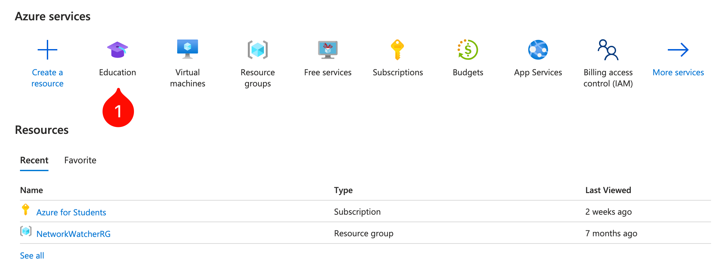
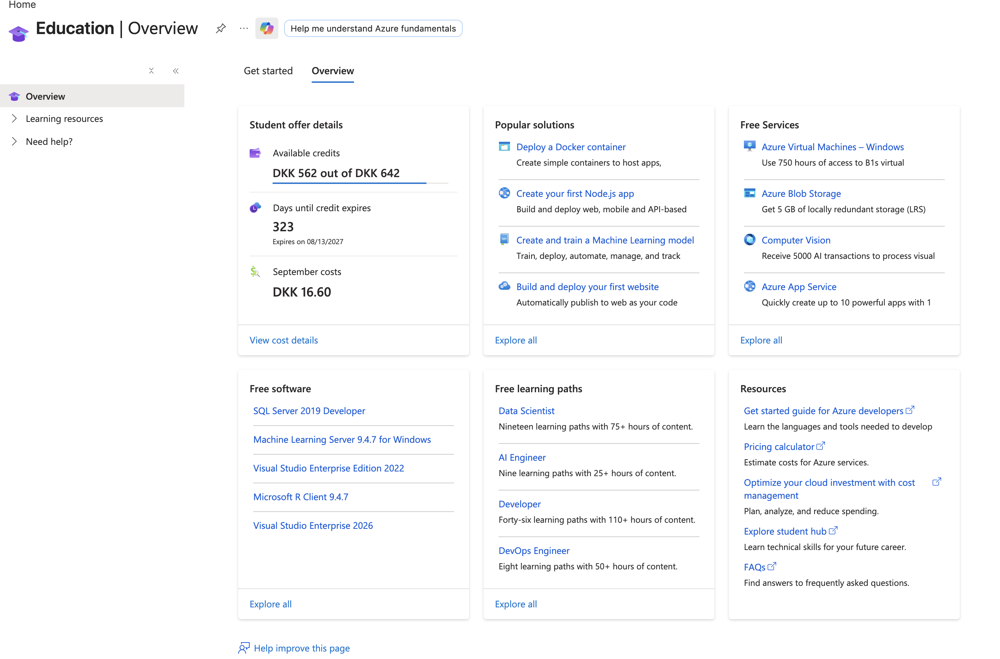
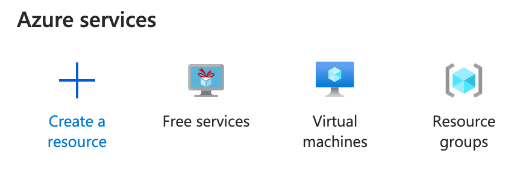
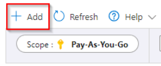
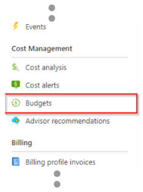
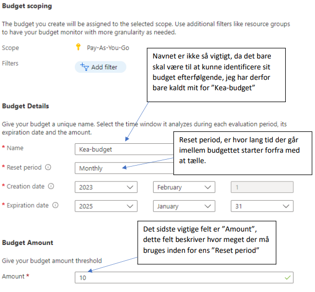
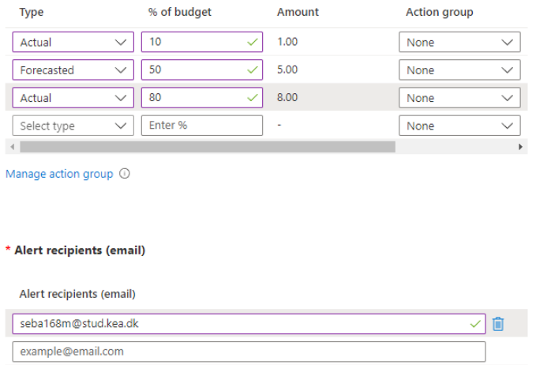

# Azure Cost Management

---

## Azure For Students

---

### Check your current spending

Azure tends to hide the spending information in new places every once in a while. 

At the time of writing, it can be found under Education (search for it).

### Advice

As much as possible, use `Azure Free Services`. Search for it and it should appear.

Delete things you don't need. Services that are stopped will still cost money. This includes resource groups.

Beware that a resource group still consumes credit even if there is no service associated with it. This can be surprisingly costly.

---

## Pay-As-You-Go

With Azure for Students you get $100 in credit for 12 months. You get the chance to renew your subscription for another 12 months if you are still a student.

But some students do not turn off their services and end up spending all their credit. 

Pay-As-You-Go subscriptions are when a credit card is associated with the account. 

In that case, it is recommended to set a limit on your spendings.

---

### Set limitations on your spendings

It is only possible to set limitations on a Pay-As-You-Go subscription. Azure For Students accounts have a cap of $100 and do not allow users to set up additional alerts. 

The way to set limitations on Azure is by creating a `budget`.

1. First, go to your subscription.

2. Then, open "**Budgets**".

3. On your budget page, you will be able to see the different limits you have set.

4. To create a new budget, click "Add".

5. This will bring you to a page where you can specify details about the new budget. As an example, I have set up the following:

6. The budget above sets a limit of 10 kr per month.

7. After entering your requested details, click "Next" at the bottom of the page.

8. On the next page, you must specify "alerts", or warnings given when reaching your limits.

9. The example given above will set up the following warnings:
- Warn if 10% of the budget has been used.
- Warn if Azure predicts that 50% or more will be used during the "Reset period".
- Warn if 80% of the budget has been used.

10. If any of the warnings is triggered, an email will be sent to `<your_email>@stud.ek.dk`.

11. When everything has been set up, just click "Create" at the bottom of the page.

